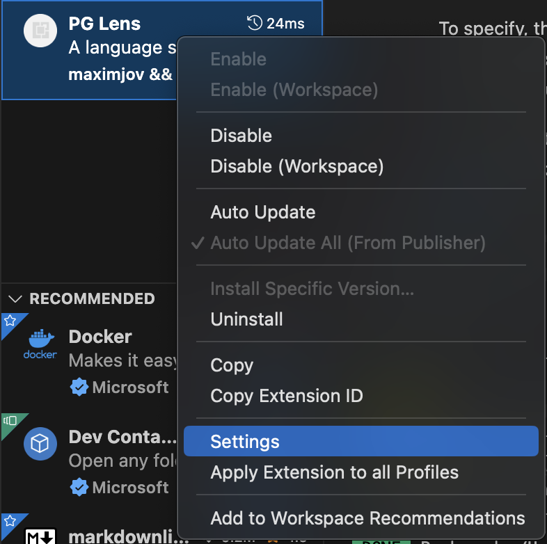
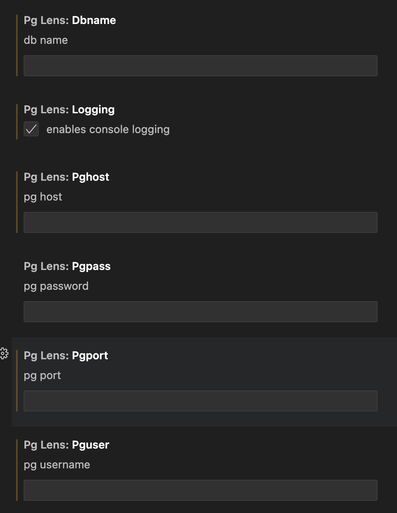

# PG_Lens
To specify, this branch is built around the vscode lsp extension source; do not expect it to function outside of vscode.

Uses Treesitter and pgsql grammar forked from @DerekStride. You can find and contribute to that [here](https://github.com/maximjov/tree-sitter-sql).

## Install

### Database Setup

You will need a postgres database with two tables set up, these are needed regardless of whether manual setup or the extension is used.

### Create Scripts

**table_columns:**
```sql
-- Table: public.table_columns

-- DROP TABLE IF EXISTS public.table_columns;

CREATE TABLE IF NOT EXISTS public.table_columns
(
    table_schema text COLLATE pg_catalog."default" NOT NULL,
    table_name text COLLATE pg_catalog."default" NOT NULL,
    column_name text COLLATE pg_catalog."default" NOT NULL,
    column_type text COLLATE pg_catalog."default" NOT NULL,
    is_not_null boolean,
    column_default text COLLATE pg_catalog."default",
    stmt text COLLATE pg_catalog."default" NOT NULL,
    start_position text COLLATE pg_catalog."default",
    end_position text COLLATE pg_catalog."default",
    path_file character varying(125) COLLATE pg_catalog."default"
)

TABLESPACE pg_default;

ALTER TABLE IF EXISTS public.table_columns
    OWNER to postgres;
```

**function_args:**
```sql
-- Table: public.function_args

-- DROP TABLE IF EXISTS public.function_args;

CREATE TABLE IF NOT EXISTS public.function_args
(
    function_name text COLLATE pg_catalog."default" NOT NULL,
    argument_name text COLLATE pg_catalog."default" NOT NULL,
    argument_type text COLLATE pg_catalog."default" NOT NULL,
    argument_default text COLLATE pg_catalog."default",
    stmt text COLLATE pg_catalog."default" NOT NULL,
    start_position text COLLATE pg_catalog."default",
    end_position text COLLATE pg_catalog."default",
    path_file character varying(125) COLLATE pg_catalog."default"
)

TABLESPACE pg_default;

ALTER TABLE IF EXISTS public.function_args
    OWNER to postgres;
```

### Secrets

Set your secrets in the settings for the extension. You'll need to set:

```
postgres username
postgres password
postgres host
postgres port
database name
logging checkbox
```

You can do this after you have installed the extension by right clicking it and picking settings from the context menu.




## Releases

Check out releases for the build .vsix extension!